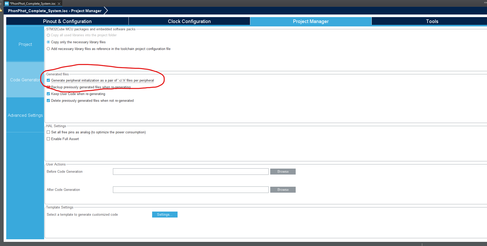
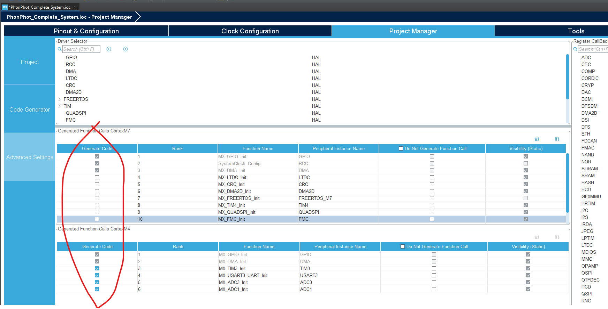

# P&P Workspace

## Currently

Trying to allow for the use of CubeMX for the cm4 only, and then use the same code for the cm7.
This commit will not contain the new updates to the .ioc, but these screenshots will show what I changed before I started replicating DSP configurations.

